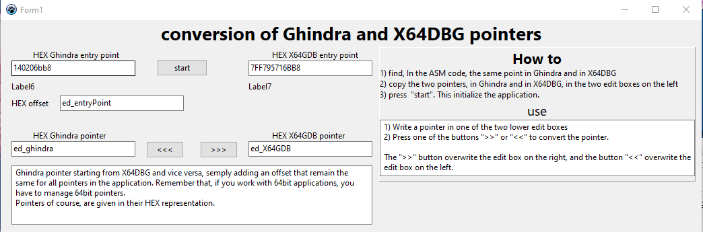

# gindra-x64GDB
Thi is a small application, written in freePascal,  that convert Ghindra pointers in X64DBG pointers, and vice versa.

Pointers in Ghindra and X64DBG differs by an offset. It's always possible to evaluate what's the  Ghindra pointer starting from X64DBG and vice versa, semply adding an offset that remain the same for all pointers in the application. Remember that, if you work with 64bit applications, you have to manage 64bit pointers.
Pointers of course, are given in their HEX representation.

# How to use
The aproach is trivial: you must provide the HEX pointer, in Ghindra and in X64DBG, corresponding to the same line of the ASM code that you are going to debug. The application calculate and keep the offset in memory. The offset is added or subtracted to the pointer that you want to transform in Ghindra pointer or X64DBG pointer.

1) Write a pointer in one of the two lower edit boxes 
2) Press one of the buttons ">>" or "<<" to convert the pointer.

The ">>" button overwrite the edit box on the right, and the button "<<" overwrite the edit box on the left.
